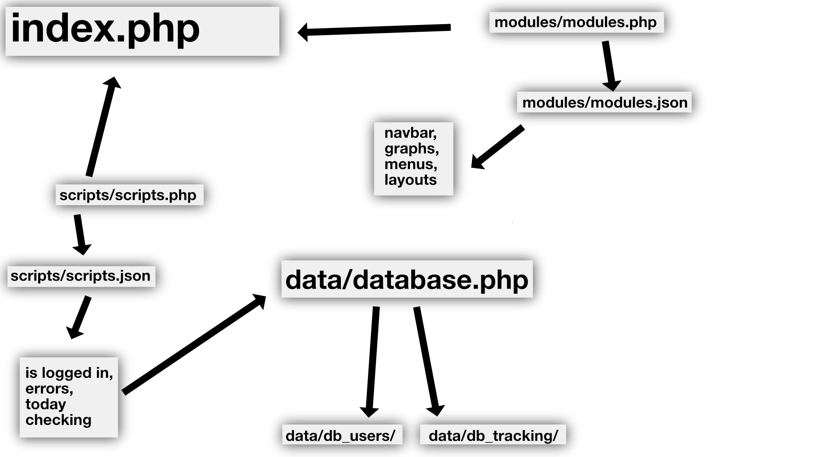
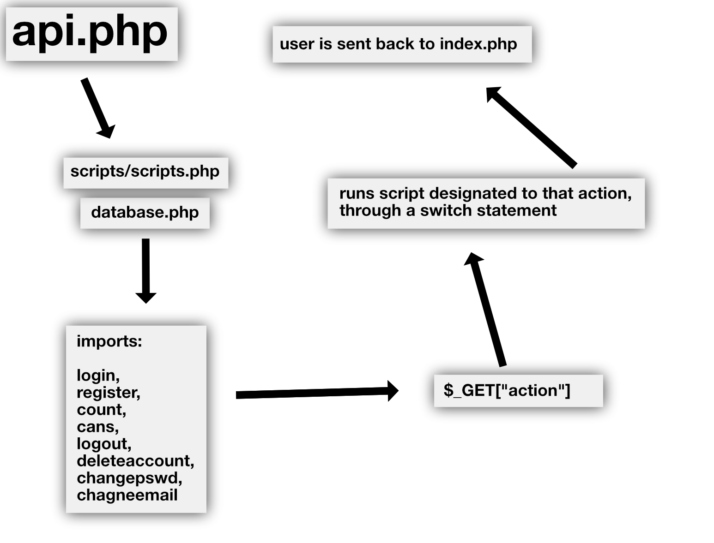
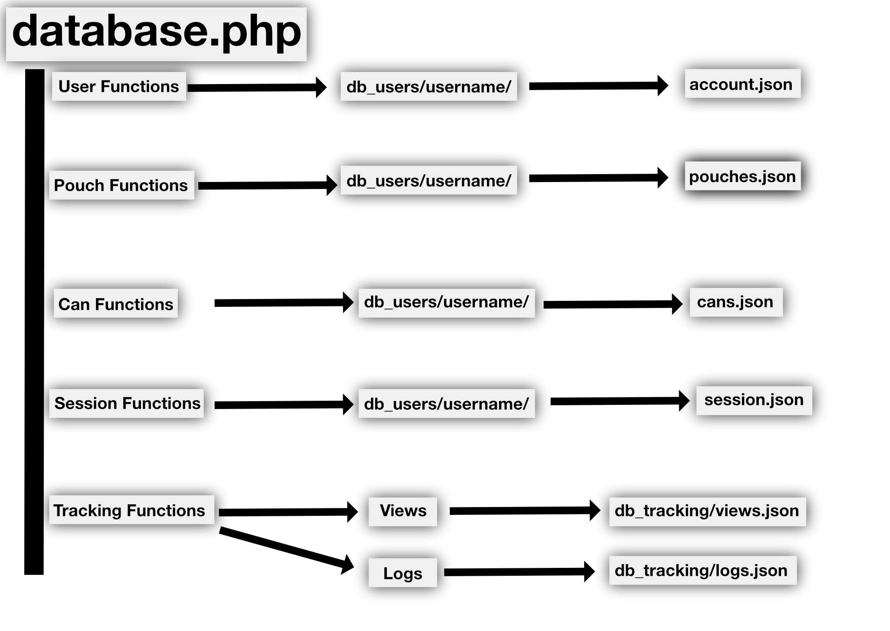

# Design Philosophy

**Page Modified**: April 21, 2025
\
**Author**: Brody King
\
**Type**: Guide

| **[« Index](/docs/index.md)** |
| ----------------------------- |

## Table of Contents

- [Getting Started](#getting-started)
  - [Table of Contents](#table-of-contents)
  - [Installation](#installation)
  - [Configuration and Security](#configuration-and-security)

## The Index

[Modules](../references/modules.md) are similar to Components in react. [Scripts](../references/scripts.md) give these moduels functionality.

## The API

When a user has done a specific action, they are sent to api.php, which does said action and sends them back to the index. You can read more at the [API Reference](../references/api.md)

## Database

This diagram shows where all the database files are actually stored. You can read more at the [Database Reference](../references/database.md)
